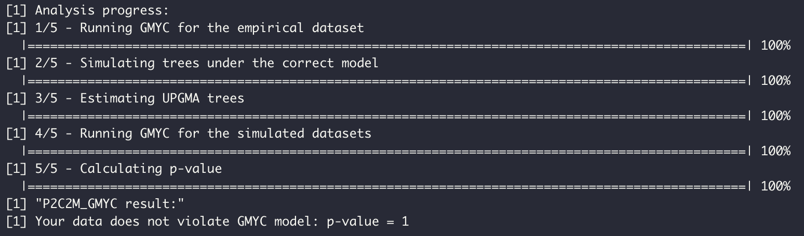
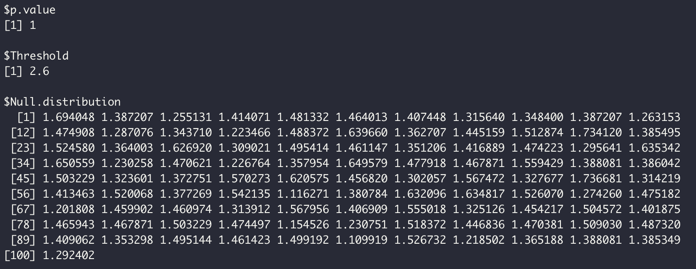

# P2C2M.GMYC

\*\* **under development** \*\*

An r-package for identifying model violations under the Generalized Mixed Yule Coalescent (GMYC) model

## Installation:

P2C2M.GMYC can be installed from Github using the function install_github implemented in devtools R-package.

```{r}
library(devtools)
devtools::install_github("emanuelmfonseca/P2C2M.GMYC")
```

P2C2M automatically installs all the dependencies, but if you get errors, try to install them individually. Here is the list of all required packages:

**install.packages("ape")**  
**install.packages("pegas")**  
**install.packages("phangorn")**  
**install.packages("phyclust")**  
**install.packages("pegas")**  
**install.packages("TreeSim")**  
**install.packages("splits", repos="http://R-Forge.R-project.org", type="source")**  
**install\_github("liamrevell/phytools")**  
 
## Example:

To run the parametric bootstrap version of the P2C2M.GMYC, users need to provide an ultrametric phylogenetic tree and a sequential fasta alignment.

### *Lygodactylus* ssp. – Lanna et al. (2018)

We included *Lygodactylus* dataset in P2C2M.GMYC as an example. The *Lygodactylus** dataset includes 66 sequences of the mitochondrial ND4 gene for 19 described species. This dataset was chosen for representing a typical dataset used in GMYC analysis, where each species can be represented from one to many sequences. So, we will investigate if the GMYC model is a good fit for the evolutionary history of *Lygodactylus* ssp. using the parametric bootstrap version.

```{r}
library(P2C2M.GMYC)

P2C2M_GMYC.Pboot(tree.input=system.file("extdata", "Lygodactylus.tre", package="P2C2M.GMYC"),
                 tree.format="nexus",
                 seq=system.file("extdata", "Lygodactylus.fas", package="P2C2M.GMYC"))
```



Results can be accessed in P2C2M_GMYC.results object.

```{r}
P2C2M_GMYC.results
```



**Reference:**

 Lanna, F.M., Werneck, F.P., Gehara, M., Fonseca, E.M., Colli, G.R., Sites-Jr., J.W., Rodrigues, M.T., and Garda, A.A. 2018. The evolutionary history of Lygodactylus lizards in the South American open diagonal. Molecular Phylogenetics and Evolution, 127: 638–645.  https://doi.org/10.1016/j.ympev.2018.06.010


